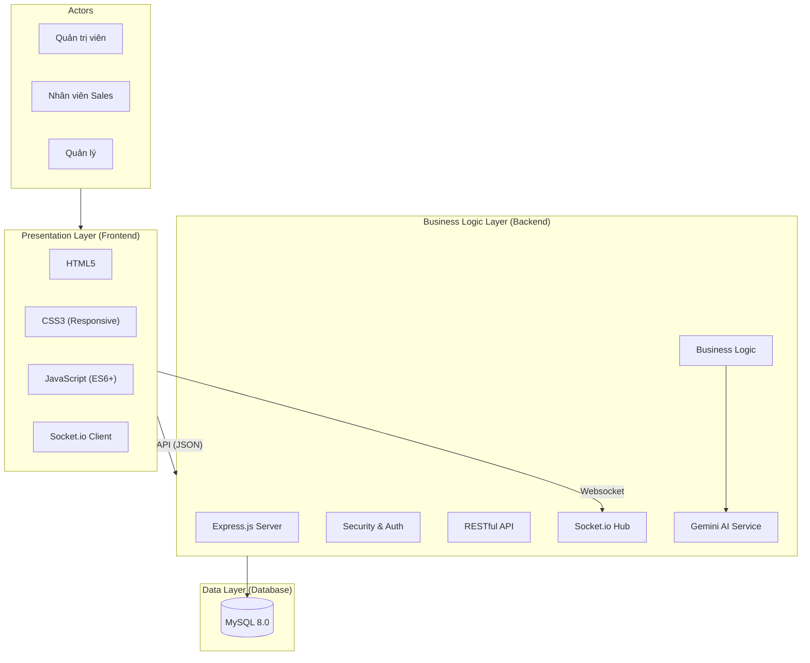
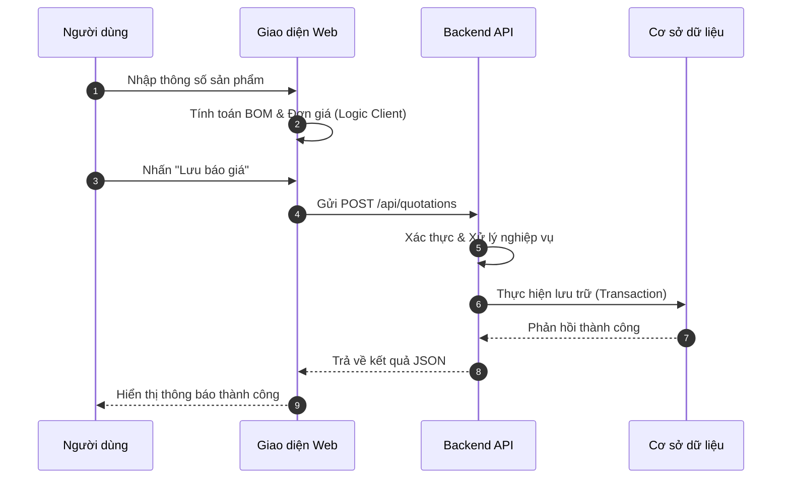

# CHƯƠNG 3: THIẾT KẾ VÀ XÂY DỰNG HỆ THỐNG

## 3.1. Công nghệ và môi trường sử dụng

Với những ưu điểm vượt trội của các công nghệ đã được phân tích và trình bày tại Chương 1, em quyết định lựa chọn và áp dụng các nền tảng này vào quá trình xây dựng hệ thống Quản lý Dự án Cửa Nhôm Kính ViralWindow. Việc lựa chọn công nghệ dựa trên tiêu chí tối ưu hóa hiệu năng, tính bảo mật cao và khả năng mở rộng linh hoạt. Cụ thể:

- **Tầng trình diễn (Presentation Layer - Frontend):** Sử dụng bộ ba công nghệ cốt lõi **HTML5, CSS3 và JavaScript (ES6+)**. Việc sử dụng mã nguồn thuần giúp hệ thống đạt tốc độ tải trang tối ưu, đảm bảo tính tương thích trên đa nền tảng và dễ dàng tùy biến giao diện theo đặc thù nghiệp vụ mà không bị ràng buộc bởi các khung làm việc (Framework) bên thứ ba.
- **Tầng logic nghiệp vụ (Business Logic Layer - Backend):** Triển khai trên môi trường **Node.js** kết hợp với framework **Express.js** để xây dựng hệ thống RESTful API mạnh mẽ. Sự kết hợp này cho phép hệ thống xử lý các yêu cầu bất đồng bộ với hiệu suất cao, đặc biệt là các tác vụ tính toán kỹ thuật phức tạp như bóc tách vật tư (BOM).
- **Tầng lưu trữ dữ liệu (Data Layer - Database):** Sử dụng hệ quản trị cơ sở dữ liệu quan hệ **MySQL 8.0**. Đây là lựa chọn tin cậy giúp đảm bảo tính toàn vẹn dữ liệu thông qua cơ chế ràng buộc chặt chẽ, hỗ trợ các giao dịch (Transactions) phức tạp và khả năng truy vấn dữ liệu lớn một cách nhanh chóng.
- **Các giải pháp công nghệ bổ trợ:**
    - **Socket.io:** Giải pháp truyền thông hai chiều thời gian thực (Full-duplex), phục vụ cho hệ thống thông báo và tương tác nội bộ tức thời.
    - **Google Gemini AI API:** Tích hợp trí tuệ nhân tạo để nâng cao năng lực phân tích dữ liệu và hỗ trợ tư vấn kỹ thuật thông minh cho người dùng.

Sự phối hợp đồng bộ giữa các tầng công nghệ này thiết lập một nền tảng vững chắc, giúp hiện thực hóa các yêu cầu chức năng và phi chức năng đã được xác lập tại Chương 2.

---

## 3.2. Bảo mật trong hệ thống

Trong bối cảnh chuyển đổi số, các hệ thống quản trị doanh nghiệp (ERP) luôn đối mặt với nhiều nguy cơ về an ninh mạng. Đối với hệ thống ViralWindow, bảo mật không chỉ nhằm bảo vệ dữ liệu tài chính mà còn đảm bảo bí mật kinh doanh và tính ổn định của quy trình vận hành. 

Hệ thống được xây dựng theo nguyên tắc **Defense in Depth** (phòng thủ nhiều lớp), triển khai các cơ chế bảo vệ từ tầng ứng dụng đến tầng dữ liệu.

### 3.2.1. Cơ chế xác thực và kiểm soát truy cập (RBAC)

Xác thực và phân quyền là lớp bảo vệ đầu tiên nhằm ngăn chặn truy cập trái phép.

- **Mã hóa mật khẩu bằng bcrypt:** Hệ thống không lưu mật khẩu dưới dạng văn bản thuần mà sử dụng kỹ thuật băm (hashing) kết hợp muối (salt). Điều này giúp chống lại các cuộc tấn công như brute-force và rainbow table.
- **Xác thực bằng JSON Web Token (JWT):** Sau khi đăng nhập thành công, hệ thống cấp một token chứa thông tin người dùng (user_id, role, exp). Token được ký bằng khóa bí mật giúp đảm bảo tính toàn vẹn và xác thực.
- **Phân quyền theo mô hình Role-Based Access Control:** Hệ thống phân chia quyền truy cập theo vai trò (RBAC) để đảm bảo nguyên tắc **Least Privilege** (đặc quyền tối thiểu):
    - **Admin:** Toàn quyền quản trị hệ thống.
    - **Manager:** Quản lý dự án và phê duyệt báo giá.
    - **Staff:** Thao tác dữ liệu trong phạm vi được cấp phép.

### 3.2.2. Bảo mật dữ liệu và phòng chống tấn công Web

Hệ thống áp dụng các biện pháp bảo mật theo khuyến nghị của OWASP nhằm giảm thiểu các lỗ hổng phổ biến:

- **Ngăn chặn SQL Injection:** Sử dụng Prepared Statements khi truy vấn MySQL để tách biệt hoàn toàn dữ liệu và câu lệnh SQL.
- **Phòng chống Cross-Site Scripting (XSS):** Dữ liệu đầu vào được kiểm tra nghiêm ngặt và dữ liệu đầu ra được mã hóa (escape) trước khi hiển thị lên trình duyệt.
- **Cấu hình Cross-Origin Resource Sharing (CORS):** Giới hạn các domain được phép truy cập API nhằm ngăn chặn các yêu cầu giả mạo từ các trang web bên thứ ba.

### 3.2.3. Giám sát và nhật ký truy vết (Activity Log)

Hệ thống không chỉ tập trung vào phòng ngừa mà còn chú trọng khả năng giám sát và phát hiện sự cố:

- **Ghi nhật ký hoạt động:** Mọi thao tác thay đổi dữ liệu đều được ghi lại vào bảng `activity_logs`, bao gồm: ID người dùng, hành động thực hiện, dữ liệu bị tác động, thời gian và địa chỉ IP.
- **Đảm bảo tính toàn vẹn:** Nhật ký hệ thống được thiết kế theo cơ chế chỉ cho phép ghi mới, tuyệt đối không cho phép chỉnh sửa hoặc xóa dữ liệu log.
- **Cảnh báo thời gian thực:** Kết hợp với Socket.IO để phát hiện và cảnh báo tức thời các hành vi bất thường như đăng nhập sai nhiều lần hoặc các thao tác xóa dữ liệu hàng loạt.

**Hướng phát triển bảo mật nâng cao:**
Nhằm nâng cao hơn nữa tính bảo mật cho môi trường vận hành thực tế, hệ thống có thể được mở rộng thêm các cơ chế:
1. Triển khai giao thức **HTTPS (SSL/TLS)** để mã hóa toàn bộ dữ liệu trên đường truyền.
2. Thiết lập **Rate Limiting** trên tầng API để phòng chống các cuộc tấn công từ chối dịch vụ (DDoS).
3. Tích hợp xác thực hai yếu tố (**2FA**) cho các tài khoản có quyền hạn cao.

---

## 3.3. Triển khai hệ thống

### 3.3.1. Môi trường triển khai

Hệ thống ViralWindow được thiết kế để có thể triển khai linh hoạt trên nhiều môi trường khác nhau, từ máy chủ nội bộ (On-premise) đến các nền tảng đám mây (Cloud). Trong giai đoạn phát triển và thử nghiệm, hệ thống được triển khai trên môi trường cục bộ với cấu hình phần cứng và phần mềm cụ thể như sau:

**Yêu cầu phần cứng tối thiểu:**
- CPU: Intel Core i5 trở lên (hoặc tương đương)
- RAM: 8GB (khuyến nghị 16GB để đảm bảo hiệu năng tốt nhất)
- Dung lượng lưu trữ: Tối thiểu 10GB ổ cứng trống

**Yêu cầu phần mềm:**
- Hệ điều hành: Windows 10/11, Ubuntu 20.04 LTS trở lên
- Node.js: phiên bản 18.x LTS
- MySQL Server: phiên bản 8.0 trở lên
- npm (Node Package Manager): phiên bản 9.x

### 3.3.2. Cấu trúc thư mục và tổ chức mã nguồn

Mã nguồn hệ thống được tổ chức theo mô hình phân tầng rõ ràng, tuân thủ nguyên tắc Separation of Concerns (phân tách mối quan tâm), giúp dễ dàng bảo trì và mở rộng:

```
ViralWindow/
├── backend/                  # Mã nguồn phía Server
│   ├── config/               # Cấu hình cơ sở dữ liệu, biến môi trường
│   ├── controllers/          # Xử lý logic nghiệp vụ
│   ├── middleware/           # Xác thực JWT, phân quyền, ghi log
│   ├── routes/               # Định nghĩa các API endpoint
│   ├── uploads/              # Lưu trữ file tải lên
│   └── server.js             # Điểm khởi động ứng dụng
│
├── FontEnd/                  # Mã nguồn phía Client
│   ├── css/                  # Tệp định dạng giao diện
│   ├── js/                   # Logic xử lý phía Client
│   ├── components/           # Thành phần UI tái sử dụng
│   └── *.html                # Các trang giao diện chức năng
│
└── package.json              # Khai báo thư viện phụ thuộc
```

### 3.3.3. Quy trình cài đặt và khởi động hệ thống

Quy trình triển khai hệ thống được thực hiện theo các bước tuần tự, đảm bảo tính nhất quán trong mọi môi trường vận hành:

**Bước 1 – Chuẩn bị cơ sở dữ liệu:**
Khởi tạo schema cơ sở dữ liệu MySQL. Hệ thống có cơ chế tự động chạy các migration scripts khi khởi động lần đầu, đảm bảo toàn bộ cấu trúc bảng dữ liệu được tạo lập đầy đủ mà không cần thao tác thủ công.

**Bước 2 – Cấu hình biến môi trường:**
Thiết lập tệp `.env` chứa các thông số kết nối cơ sở dữ liệu, khóa bí mật JWT và API key của Google Gemini. Việc tách biệt cấu hình khỏi mã nguồn giúp hệ thống dễ dàng chuyển đổi giữa các môi trường (Development, Production) mà không cần sửa đổi code.

**Bước 3 – Cài đặt thư viện phụ thuộc:**
Sử dụng lệnh `npm install` để tự động tải xuống và cài đặt toàn bộ các thư viện (Dependencies) được khai báo trong tệp `package.json`, bao gồm Express.js, Socket.io, mysql2, bcrypt, jsonwebtoken và @google/generative-ai.

**Bước 4 – Khởi động dịch vụ:**
Thực thi lệnh `node server.js` (hoặc `npm start`) để khởi động máy chủ. Hệ thống sẽ tự động kết nối cơ sở dữ liệu, chạy migration và lắng nghe các yêu cầu đến.

### 3.3.4. Quản lý gói phụ thuộc và thư viện

Hệ thống sử dụng npm làm công cụ quản lý gói. Bảng dưới đây liệt kê các thư viện phụ thuộc chính được sử dụng trong hệ thống:

| Thư viện               | Phiên bản | Mục đích sử dụng                                  |
|------------------------|-----------|---------------------------------------------------|
| express                | ^4.18.x   | Framework xây dựng REST API                       |
| mysql2                 | ^3.x      | Driver kết nối MySQL với hỗ trợ Prepared Statements|
| socket.io              | ^4.x      | Xử lý truyền thông thời gian thực                |
| jsonwebtoken           | ^9.x      | Tạo và xác thực JSON Web Token                    |
| bcrypt                 | ^5.x      | Mã hóa mật khẩu người dùng                        |
| multer                 | ^1.x      | Xử lý tải file (multipart/form-data)              |
| @google/generative-ai  | ^0.x      | Tích hợp Google Gemini AI                         |
| cors                   | ^2.x      | Cấu hình chính sách truy cập nguồn gốc (CORS)     |
| dotenv                 | ^16.x     | Quản lý biến môi trường từ tệp .env               |

*Bảng 3.1. Danh sách các thư viện phụ thuộc chính của hệ thống ViralWindow*

---

## 3.4. Thiết kế kiến trúc hệ thống

Kiến trúc hệ thống được thiết kế theo hướng module hóa, đảm bảo tính độc lập giữa các thành phần và dễ dàng bảo trì, nâng cấp.

### 3.3.1. Mô hình kiến trúc phân lớp Client-Server

Hệ thống tuân thủ mô hình kiến trúc ba lớp (3-Tier Architecture) truyền thống nhưng được hiện đại hóa thông qua các giao thức Web hiện đại:
- **Tầng Trình diễn (Presentation Layer):** Giao diện web tương tác trực tiếp với người dùng.
- **Tầng Logic nghiệp vụ (Application Layer):** Máy chủ xử lý yêu cầu, điều phối luồng dữ liệu và thực thi logic.
- **Tầng Dữ liệu (Data Layer):** Hệ quản trị cơ sở dữ liệu lưu trữ thông tin bền vững.

### 3.3.2. Sơ đồ kiến trúc tổng thể

Sơ đồ dưới đây mô tả cấu trúc các thành phần và luồng tương tác trong hệ thống:


*Hình 3.1. Sơ đồ kiến trúc tổng thể hệ thống ViralWindow*

---

## 3.4. Thiết kế và Xây dựng tầng Backend

Tầng Backend được coi là hạt nhân xử lý của hệ thống, nơi tập trung toàn bộ các quy tắc nghiệp vụ và đảm bảo tính toàn vẹn dữ liệu.

### 3.4.1. Cấu trúc mã nguồn và Middleware

Mã nguồn Backend được tổ chức theo mô hình phân tách trách nhiệm (Separation of Concerns). Hệ thống sử dụng các Middleware như một bộ lọc trung gian để xử lý các tác vụ xuyên suốt (Cross-cutting concerns) như xác thực JWT, ghi log hoạt động và xử lý lỗi tập trung. Điều này giúp mã nguồn trở nên gọn gàng, dễ kiểm thử và bảo trì.

### 3.4.2. Xây dựng RESTful API

Hệ thống cung cấp một tập hợp các API chuẩn RESTful, giúp tầng Frontend có thể truy xuất dữ liệu một cách nhất quán thông qua các phương thức HTTP tiêu chuẩn (GET, POST, PUT, DELETE). Việc chuẩn hóa API cũng tạo điều kiện thuận lợi cho việc tích hợp với các ứng dụng di động hoặc hệ thống của bên thứ ba trong tương lai.

---

## 3.5. Thiết kế và Xây dựng tầng Frontend

Tầng Frontend tập trung vào việc mang lại trải nghiệm người dùng tối ưu nhất (User Experience) trên một giao diện chuyên nghiệp và hiện đại.

### 3.5.1. Triết lý thiết kế UI/UX

Giao diện được thiết kế theo phong cách tối giản, sử dụng hệ thống lưới (Grid system) và Flexbox để đảm bảo tính đáp ứng (Responsive). Các thành phần UI được module hóa thành các Component dùng chung (Header, Sidebar, Modals), giúp đảm bảo tính nhất quán về mặt thị giác trên toàn bộ hệ thống.

### 3.5.2. Các Module chức năng chính

Hệ thống tập trung xây dựng các module nghiệp vụ then chốt:
- **Quản lý Dự án và Báo giá:** Module này tích hợp bộ máy tính toán (Calculation Engine) bằng JavaScript để bóc tách vật tư thực tế (BOM) ngay tại trình duyệt, giảm tải cho Server và mang lại phản hồi tức thì cho người dùng.
- **Quản lý Kho vật tư:** Cung cấp giao diện theo dõi tồn kho theo thời gian thực, tích hợp cảnh báo thông minh khi vật tư xuống dưới ngưỡng an toàn.


*Hình 3.2. Sơ đồ trình tự luồng nghiệp vụ Tạo báo giá*

---

## 3.6. Tích hợp Công nghệ tiên tiến

### 3.6.1. Ứng dụng Trí tuệ nhân tạo (AI)

Hệ thống tích hợp mô hình ngôn ngữ lớn **Google Gemini AI** để hỗ trợ người quản trị trong việc phân tích các báo cáo kinh doanh phức tạp và đưa ra các gợi ý tối ưu hóa quy trình nhập hàng dựa trên dữ liệu lịch sử.

### 3.6.2. Truyền thông thời gian thực (Real-time)

Thông qua **Socket.io**, hệ thống thiết lập một kênh giao tiếp liên tục giữa Client và Server. Điều này cho phép đẩy các thông báo quan trọng (như có báo giá mới cần duyệt hoặc vật tư sắp hết) đến người dùng ngay lập tức mà không cần thực hiện tải lại trang (Refresh).

---

## 3.7. Tối ưu hóa hiệu năng hệ thống

Để đảm bảo hệ thống vận hành ổn định trong môi trường doanh nghiệp, các giải pháp tối ưu hóa đã được triển khai:
- **Tối ưu truy vấn:** Sử dụng chỉ mục (Indexing) cho các trường dữ liệu thường xuyên tìm kiếm và tối ưu hóa các câu lệnh SQL phức tạp.
- **Tối ưu tài nguyên Frontend:** Áp dụng kỹ thuật nén ảnh, tối ưu hóa kích thước file CSS/JS và tận dụng bộ nhớ đệm (Cache) trình duyệt để giảm thiểu thời gian tải trang.

---

## 3.8. Kết luận chương

Chương 3 đã trình bày một cách hệ thống quá trình thiết kế kiến trúc và triển khai xây dựng hệ thống Quản lý Dự án Cửa Nhôm Kính ViralWindow. Từ việc lựa chọn nền tảng công nghệ phù hợp, thiết lập cơ chế bảo mật đa lớp, đến việc xây dựng các tầng kiến trúc Backend/Frontend và tích hợp AI, hệ thống đã hình thành một giải pháp quản trị toàn diện, sẵn sàng cho giai đoạn thử nghiệm và triển khai thực tế.
